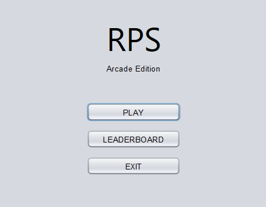
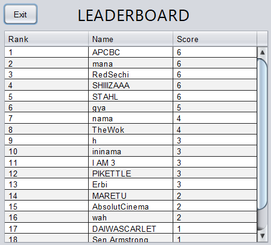
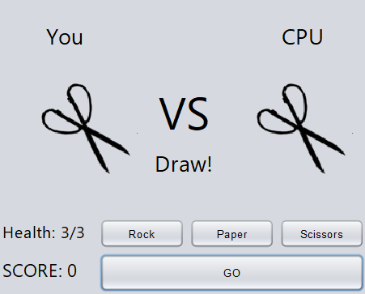

# RPS Legends
A simple rock-paper-scissors game made with Java
## Features
* Randomly generated CPU choices
* Leaderboard
## How To Run Locally
1. Clone the repository
2. Import the included SQL file into MySQL
3. Run using your IDE of choice
## Screenshots
* Title Page

* Leaderboards

* Gameplay

